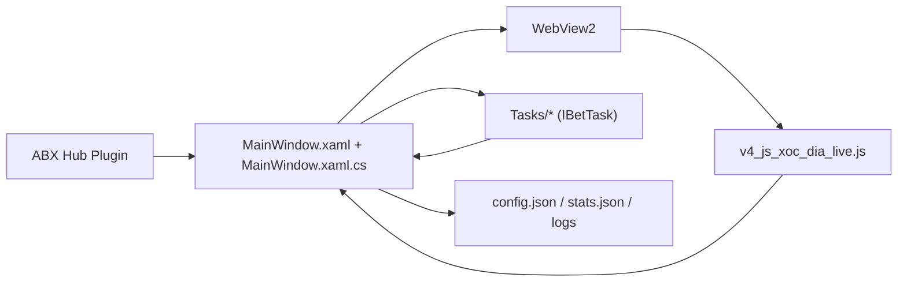

# Architecture

## Tổng Quan

App có kiến trúc thực tế dạng:

Thực tế code đang thiên về mô hình `God Window`: [`MainWindow.xaml.cs`](D:/PROJECT/ABXHubSolution/TaiXiuLiveSun/MainWindow.xaml.cs) giữ gần như toàn bộ orchestration.

## Cấu Trúc Project

- [`App.xaml`](D:/PROJECT/ABXHubSolution/TaiXiuLiveSun/App.xaml), [`App.xaml.cs`](D:/PROJECT/ABXHubSolution/TaiXiuLiveSun/App.xaml.cs)
  - entry WPF, resource ảnh global
- [`MainWindow.xaml`](D:/PROJECT/ABXHubSolution/TaiXiuLiveSun/MainWindow.xaml)
  - layout chính: `WebView2` bên trái, control/status/history bên phải
- [`MainWindow.xaml.cs`](D:/PROJECT/ABXHubSolution/TaiXiuLiveSun/MainWindow.xaml.cs)
  - config, WebView lifecycle, JS message handling, task orchestration, history, stats, license/trial
- [`MainWindow.Startup.cs`](D:/PROJECT/ABXHubSolution/TaiXiuLiveSun/MainWindow.Startup.cs)
  - startup flow dùng lại cho standalone và plugin
- [`MainWindow.EmbedMode.cs`](D:/PROJECT/ABXHubSolution/TaiXiuLiveSun/MainWindow.EmbedMode.cs)
  - tạo nội dung nhúng cho Hub
- [`WebView2LiveBridge.cs`](D:/PROJECT/ABXHubSolution/TaiXiuLiveSun/WebView2LiveBridge.cs)
  - bridge riêng cho inject/reinject top/frame
- [`v4_js_xoc_dia_live.js`](D:/PROJECT/ABXHubSolution/TaiXiuLiveSun/v4_js_xoc_dia_live.js)
  - boot game, quét Cocos/canvas, push snapshot, bet queue, trace
- [`Tasks/`](D:/PROJECT/ABXHubSolution/TaiXiuLiveSun/Tasks)
  - toàn bộ chiến lược + helper cược
- [`TaiXiuLiveSunPlugin.cs`](D:/PROJECT/ABXHubSolution/TaiXiuLiveSun/TaiXiuLiveSunPlugin.cs)
  - adapter plugin vào ABX Hub
- [`Models.cs`](D:/PROJECT/ABXHubSolution/TaiXiuLiveSun/Models.cs)
  - `CwSnapshot`, `CwTotals`, `DecisionState`
- [`Compat/PackRes.cs`](D:/PROJECT/ABXHubSolution/TaiXiuLiveSun/Compat/PackRes.cs)
  - load resource ảnh + fallback
- [`Views/PluginStubView.xaml`](D:/PROJECT/ABXHubSolution/TaiXiuLiveSun/Views/PluginStubView.xaml)
  - stub control cho Hub
- [`chip_focus_probe_test.js`](D:/PROJECT/ABXHubSolution/TaiXiuLiveSun/chip_focus_probe_test.js)
  - script chẩn đoán chip/canvas focus

## Module Chính

### 1. UI Shell

- `MainWindow.xaml`
- Trách nhiệm:
  - render WebView
  - tab chiến lược
  - control money/strategy
  - status/sequence/history/stats

### 2. Runtime Orchestrator

- `MainWindow.xaml.cs`
- Trách nhiệm:
  - load/save config, stats, logs
  - init WebView2
  - nhận message từ JS
  - giữ `_lastSnap`
  - start/stop task
  - finalize pending bets
  - license/trial/lease

### 3. Browser Bridge

- `WebView2LiveBridge.cs`
- `v4_js_xoc_dia_live.js`
- Trách nhiệm:
  - inject script vào top page và iframe
  - detect đúng game scene
  - push snapshot định kỳ
  - expose `__cw_bet`, `__cw_bet_enqueue`, `__cw_startPush`

### 4. Strategy Engine

- `Tasks/IBetTask.cs`
- `Tasks/GameContext.cs`
- `Tasks/TaskUtil.cs`
- `Tasks/MoneyManager.cs`
- `Tasks/MoneyHelper.cs`
- các `*Task.cs`
- Trách nhiệm:
  - đọc snapshot
  - quyết định cửa cược
  - tính tiền cược
  - chờ kết quả và cập nhật win/loss

### 5. Plugin Adapter

- `TaiXiuLiveSunPlugin.cs`
- `PluginProbe.cs`
- `Views/PluginStubView.*`
- Trách nhiệm:
  - mở `MainWindow` từ Hub
  - inject resource ảnh
  - cleanup khi plugin stop/close

## Dependency Giữa Các Module

- `MainWindow` phụ thuộc vào:
  - `WebView2`
  - `Tasks/*`
  - `Models.cs`
  - `PackRes/FallbackIcons`
  - `ABX.Core` khi chạy plugin
- `Tasks/*` phụ thuộc vào:
  - `GameContext`
  - `TaskUtil`
  - `MoneyManager` / `MoneyHelper`
  - `CwSnapshot`
- JS không biết WPF; JS chỉ biết contract `abx` message và các hàm `__cw_*`.

## File Nào Phụ Trách Gì

- `MainWindow.xaml.cs`
  - trung tâm toàn bộ runtime
- `Tasks/Seq*`, `Pattern*`
  - chiến lược nhập tay theo chuỗi/pattern
- `Tasks/SmartPrev*`, `Random*`, `RunLengthBias*`, `StateTransitionBias*`, `Ensemble*`, `Top10*`, `Knn*`, `DualSchedule*`, `TimeSliced*`
  - heuristic/statistical strategies
- `Tasks/AiStat*`, `AiOnlineNGram*`, `AiExpertPanel*`
  - AI/adaptive strategies
- `Tasks/JackpotMultiSideTask.cs`
  - chiến lược multi-side đặc biệt
- `Tasks/SideRateParser.cs`
  - parse text `SIDE:RATIO`

## Data Flow

1. JS đọc game state từ Cocos/canvas.
2. JS post snapshot JSON về C#.
3. C# deserialize thành `CwSnapshot`, lưu `_lastSnap`.
4. C# update UI từ snapshot.
5. Task đọc `_lastSnap` qua `GameContext.GetSnap`.
6. Task gọi `PlaceBet` để gửi intent xuống JS queue.
7. JS thực thi click/select chip/bet target.
8. C# ghi pending history, sau đó chờ `seq` đổi để finalize.

## Websocket Packet Flow

- Packet flow thật đang có 2 lớp:
  - `Game network websocket`:
    - chỉ log/debug qua CDP nếu bật
    - không dùng trực tiếp cho quyết định chiến lược
  - `In-app message bridge`:
    - JS -> `chrome.webview.postMessage`
    - C# -> `ExecuteScriptAsync`
- Message quan trọng:
  - `cw_page_probe`: probe URL/scene
  - `game_hint`: đã có iframe/game
  - `tick`: snapshot chính
  - `bet`: ack bet từ JS
  - `bet_error`: lỗi bet
  - `bet_trace`: trace click/target/bet pipeline

## UI Update Flow

- `WebMessageReceived` parse message
- `tick`:
  - update progress/countdown
  - update result icon
  - update account/username
  - update sequence strip
  - update status label
- strategy runtime:
  - task gọi callback UI trong `GameContext`
  - callback quay về `Dispatcher.Invoke`
  - update `LastSide`, `LastStake`, `WinTotal`, `Win/Loss`, chain level, stats
- log UI:
  - enqueue queue
  - log pump flush định kỳ

## OCR / Canvas Flow

- Không thấy OCR engine riêng.
- Cách đọc game hiện tại là:
  - dò URL/context
  - dò `cc.director.getScene()`
  - traverse node tree Cocos
  - đọc label/path/tail
  - suy ra countdown, totals, last results, chip positions, bet zones
- Đây là canvas/scene introspection, không phải OCR ảnh pixel truyền thống.
- `chip_focus_probe_test.js` dùng để debug chip panel/geometry.

## Điểm Kiến Trúc Cần Nhớ Khi AI Code

- `MainWindow.xaml.cs` là source of truth runtime hiện tại.
- `GameContext` là boundary tốt nhất để thêm logic strategy mới.
- JS selectors/path Cocos rất brittle; đổi phải có lý do rõ.
- `Release` single-file và `Debug` plugin có khác biệt deployment/path.

