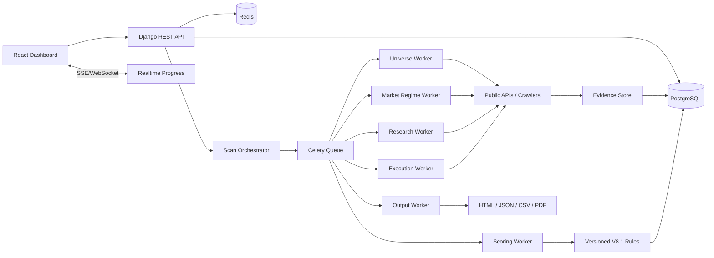

# KẾ HOẠCH TRIỂN KHAI PROJECT HOÀN CHỈNH

## COIN SPOT SCANNER V8.1 — EXECUTION INTEGRITY

**Trạng thái tài liệu:** Baseline triển khai sau khi giao diện đã được duyệt  
**Phiên bản kế hoạch:** 1.0  
**Ngày lập:** 06/08/2026  
**Căn cứ nghiệp vụ:** Bộ 6 file `COIN SPOT AI SPECIFICATION V8.1 PROFESSIONAL — EXECUTION INTEGRITY`  
**Mục tiêu sản phẩm:** Tự động quét thị trường Spot, thu thập bằng chứng, áp dụng Hard Rule, chấm Quality/Entry/Opportunity và chỉ công bố BUY_SETUP khi đủ dữ liệu thực thi.

---

# 1. MỤC TIÊU DỰ ÁN

Xây dựng một phần mềm web chuyên nghiệp có thể:

1. Quét Top N coin từ CoinGecko hoặc CoinMarketCap.
2. Chỉ giữ coin có Binance Spot/USDT theo cấu hình.
3. Tự động thực hiện tuần tự sáu bước:
   - Universe Scan.
   - Market Regime.
   - Research Shortlist.
   - Execution Verification.
   - Scoring & Validation.
   - Kết quả đầu tư.
4. Cho phép chạy toàn bộ quy trình bằng một nút.
5. Cho phép chạy riêng từng bước.
6. Cho phép từng bước tự chạy theo lịch riêng.
7. Cho phép quyết định cách xử lý dữ liệu khi chạy quét tổng:
   - Luôn lấy dữ liệu mới.
   - Chỉ lấy lại khi dữ liệu cũ hoặc đầu vào thay đổi.
   - Dùng dữ liệu hợp lệ gần nhất.
8. Theo dõi trực quan trạng thái, tiến độ, nhật ký và lỗi.
9. Quản lý nhiều cấu hình checklist có version, so sánh và khôi phục.
10. Lưu đầy đủ nguồn, timestamp, Evidence Level, freshness và Confidence.
11. Xuất báo cáo đúng `03_OUTPUT_V8_1.md`.
12. Không tạo BUY_SETUP khi thiếu dữ liệu critical.
13. Chạy local miễn phí trong giai đoạn phát triển.
14. Sẵn sàng triển khai trên AWS Lightsail, Ubuntu, Docker và Nginx.

---

# 2. PHẠM VI PHIÊN BẢN 1.0

## 2.1. Bao gồm

- Đăng nhập và phân quyền quản trị.
- Dashboard tổng quan đã duyệt.
- Điều phối quy trình sáu bước.
- Lịch chạy tự động cho từng bước.
- Chạy ngay từng bước.
- Chạy toàn bộ sáu bước.
- Resume, retry, queue và run lock.
- CoinGecko universe collector.
- Binance REST/WebSocket collector.
- Kline D1/4H.
- Orderbook, spread, depth và slippage.
- Market Regime.
- Research Shortlist.
- Unlock adapters nhiều nguồn.
- Product metrics adapters.
- Token Value Capture evidence.
- Risk Register.
- Quality Score.
- Entry Score.
- Opportunity Score.
- Report Validation Gate.
- Capital Plan.
- Danh sách coin vắn tắt.
- Trang chi tiết coin.
- Cài đặt Checklist.
- Hồ sơ cấu hình và lịch sử version.
- Chạy thử cấu hình.
- So sánh hai cấu hình.
- Thông báo trong ứng dụng.
- Xuất HTML, JSON, CSV.
- Xuất PDF ở giai đoạn hoàn thiện.
- Docker Compose local.
- Docker Compose production.
- Nginx, HTTPS, backup và deploy scripts.

## 2.2. Không bao gồm trong bản 1.0

- Futures, Margin hoặc leverage.
- Tự động đặt lệnh giao dịch.
- Lưu API key có quyền trade.
- Bypass CAPTCHA, paywall hoặc cơ chế chống bot.
- Cam kết lợi nhuận.
- Hệ thống thanh toán/gói thuê bao.
- Mobile app native.
- AI tự sửa Hard Rule hoặc tự thay điểm.

---

# 3. NGUYÊN TẮC KIẾN TRÚC

## 3.1. Deterministic Core

Phần quyết định cuối cùng phải chạy bằng rule engine có thể tái lập:

- Hard Rule.
- Quality Score.
- Entry Score.
- Opportunity Score.
- Score Status.
- Risk Register.
- Capital Plan.
- Report Validation Gate.

AI, nếu được bổ sung sau, chỉ được hỗ trợ:

- Tóm tắt tài liệu.
- Trích xuất bằng chứng.
- Gợi ý mapping.
- Phân loại nội dung cần review.

AI không được:

- Vượt Hard Rule.
- Tạo BUY_SETUP khi dữ liệu thiếu.
- Tự thay trọng số.
- Tự coi UNKNOWN là PASS.

## 3.2. Evidence-first

Mọi dữ liệu dùng để chấm điểm phải có:

- Source name.
- Source URL.
- Collected at.
- Data timestamp.
- Freshness status.
- Parser version.
- Evidence Level E0–E4.
- Confidence.
- Raw payload checksum.
- Data status: PASS, UNKNOWN, CONFLICT, STALE hoặc NOT_APPLICABLE.

## 3.3. Configuration Snapshot

Khi bắt đầu Scan Run:

- Sao chép toàn bộ cấu hình đang dùng.
- Khóa snapshot cho riêng run đó.
- Mọi thay đổi sau khi run bắt đầu chỉ áp dụng cho run tiếp theo.
- Lưu `profile_id`, `profile_version`, `ruleset_version` và checksum.

## 3.4. Dependency Invalidation

Khi dữ liệu ở một bước thay đổi:

- Tất cả bước phụ thuộc phía sau chuyển `STALE`.
- Không dùng kết quả cũ như kết quả hiện hành.
- Hệ thống quyết định chạy lại theo chính sách của từng bước.

Ví dụ:

```text
Universe Scan thay đổi
→ Research Shortlist STALE
→ Execution Verification STALE
→ Scoring & Validation STALE
→ Kết quả đầu tư STALE
```

---

# 4. CÔNG NGHỆ

## 4.1. Frontend

- React.
- TypeScript.
- Vite.
- Ant Design.
- TanStack Query.
- Zustand hoặc Redux Toolkit cho trạng thái giao diện.
- Apache ECharts cho biểu đồ.
- WebSocket/SSE cho tiến độ thời gian thực.
- React Router.
- Zod cho validation phía client.

## 4.2. Backend

- Python 3.12.
- Django.
- Django REST Framework.
- Django Channels hoặc Server-Sent Events.
- Celery.
- Celery Beat.
- Redis.
- PostgreSQL.
- Pydantic cho data contracts của collector.
- Pandas/NumPy cho xử lý dữ liệu.
- TA-Lib hoặc thư viện indicator được kiểm thử; ưu tiên tự triển khai các chỉ báo cốt lõi để dễ tái lập.

## 4.3. Crawl và Browser Automation

- HTTPX/Requests: phương án đầu tiên.
- BeautifulSoup/lxml: parse HTML tĩnh.
- JSON-LD, `__NEXT_DATA__`, embedded JSON: ưu tiên trước Selenium.
- Selenium WebDriver + Chrome headless: chỉ dùng khi trang cần JavaScript.
- Selenium Manager: tự quản lý driver.
- Retry/backoff.
- Rate limit theo từng nguồn.
- Proxy không dùng mặc định.
- Không bypass CAPTCHA/paywall.

## 4.4. Triển khai

- Docker.
- Docker Compose.
- Ubuntu.
- Nginx reverse proxy.
- Gunicorn.
- Celery worker.
- Celery Beat.
- PostgreSQL container hoặc managed database tùy giai đoạn.
- Redis container.
- Chrome headless worker riêng.
- Certbot/Let’s Encrypt.
- AWS Lightsail làm production target.

---

# 5. KIẾN TRÚC TỔNG THỂ



---

# 6. CẤU TRÚC REPOSITORY

```text
coin-spot-scanner-v8.1/
├── README.md
├── .env.example
├── docker-compose.local.yml
├── docker-compose.production.yml
├── Makefile
├── frontend/
│   ├── src/
│   │   ├── app/
│   │   ├── components/
│   │   ├── features/
│   │   │   ├── dashboard/
│   │   │   ├── scan-runs/
│   │   │   ├── coins/
│   │   │   ├── risk-register/
│   │   │   ├── reports/
│   │   │   └── checklist-settings/
│   │   ├── services/
│   │   ├── stores/
│   │   ├── types/
│   │   └── utils/
│   └── tests/
├── backend/
│   ├── config/
│   ├── apps/
│   │   ├── accounts/
│   │   ├── assets/
│   │   ├── data_sources/
│   │   ├── evidence/
│   │   ├── market_data/
│   │   ├── universe/
│   │   ├── market_regime/
│   │   ├── research/
│   │   ├── execution/
│   │   ├── scoring/
│   │   ├── risk_register/
│   │   ├── checklist_profiles/
│   │   ├── scan_orchestration/
│   │   ├── reports/
│   │   ├── notifications/
│   │   └── audit/
│   ├── collectors/
│   │   ├── base/
│   │   ├── coingecko/
│   │   ├── binance/
│   │   ├── unlocks/
│   │   ├── defillama/
│   │   ├── project_official/
│   │   └── explorers/
│   ├── rules/
│   │   └── v8_1/
│   │       ├── defaults.yaml
│   │       ├── quality_weights.yaml
│   │       ├── entry_weights.yaml
│   │       ├── hard_rules.yaml
│   │       ├── freshness.yaml
│   │       ├── evidence_caps.yaml
│   │       ├── risk_codes.yaml
│   │       ├── capital_plan.yaml
│   │       └── report_validation.yaml
│   ├── services/
│   └── tests/
├── infrastructure/
│   ├── nginx/
│   ├── systemd/
│   ├── scripts/
│   │   ├── install.sh
│   │   ├── deploy.sh
│   │   ├── update.sh
│   │   ├── backup.sh
│   │   ├── restore.sh
│   │   └── health-check.sh
│   └── monitoring/
└── docs/
    ├── architecture/
    ├── api/
    ├── database/
    ├── collectors/
    ├── operations/
    └── acceptance/
```

---

# 7. LUỒNG SÁU BƯỚC

## 7.1. Bước 1 — Universe Scan

### Đầu vào

- Nguồn universe.
- Top coin count.
- Token type exclusions.
- Binance Spot/USDT requirement.
- Market Cap ranges.
- Liquidity pre-filter.
- Mapping configuration.

### Công việc

1. Lấy Top N coin.
2. Chuẩn hóa ticker, slug, chain và contract.
3. Đồng bộ Binance `exchangeInfo`.
4. Loại token không phù hợp.
5. Phân nhóm Market Cap.
6. Chạy liquidity pre-filter.
7. Chạy supply/unlock pre-filter nếu đã có cache.
8. Tạo Universe Accounting.

### Đầu ra

- Universe snapshot.
- Asset mappings.
- Excluded records.
- Universe Accounting.
- Danh sách coin đủ điều kiện nghiên cứu.

### Điều kiện hoàn tất

- Initial count xác định.
- Binance eligible count xác định.
- Các nhóm loại có số lượng rõ.
- Không có mapping conflict chưa xử lý trong candidate pool.
- Snapshot có timestamp và source.

---

## 7.2. Bước 2 — Market Regime

### Dữ liệu

- BTC D1.
- BTC 4H.
- ETH D1/4H.
- BTC.D.
- ETH/BTC.
- TOTAL3 hoặc proxy.
- Breadth.
- Tỷ lệ coin trên MA20 D1.
- Altcoin volume 7D.
- Macro/legal/event risk.

### Đầu ra

- THUẬN LỢI, TRUNG TÍNH hoặc XẤU.
- FINAL hoặc PROVISIONAL.
- Confidence.
- Completeness count.
- Các Hard Rule thị trường đang kích hoạt.

### Điều kiện hoàn tất

- 8–9 nhóm: có thể FINAL.
- Thiếu 1–2 nhóm: PROVISIONAL.
- Thiếu từ 3 nhóm: Confidence LOW, không nâng BUY_SETUP.

---

## 7.3. Bước 3 — Research Shortlist

### Công việc

- Chạy Red Flag.
- Thu thập Product/Usage.
- Thu thập tokenomics.
- Thu thập Structural Liquidity.
- Xác minh value capture.
- Định giá và peer comparison.
- Chấm Quality sơ bộ hoặc FINAL.
- Chọn 10–15 coin theo cấu hình.

### Đầu ra

- Research Shortlist.
- QUALITY_HIGH_WAIT_ENTRY.
- WATCH_ONLY.
- BLOCKED.
- EXCLUDE.
- Quality breakdown.
- Evidence matrix.

### Điều kiện hoàn tất

- Mỗi coin có Score Status.
- Không coin UNKNOWN critical được xem như PASS.
- Top candidate có subscore và Evidence Level.

---

## 7.4. Bước 4 — Execution Verification

### Công việc

Cho 3–5 coin đầu:

- Binance Spot status.
- Giá hiện hành.
- Kline D1/4H.
- Orderbook live.
- Spread.
- Depth ±0.5% và ±1%.
- Slippage 5M/10M/25M VND.
- Relative Volume.
- Relative Strength.
- Overhead Supply.
- Unlock 7D/30D/90D.
- Entry zone theo rule.
- Stop/invalidation.
- TP1/TP2/TP3.
- RR1/RR2.
- ATR distance.
- CHASE detection.

### Đầu ra

- Execution dataset.
- Entry Score inputs.
- Hard Rule decisions.
- Data Coverage Matrix.

### Điều kiện hoàn tất

Coin chỉ đủ điều kiện tiếp tục khi:

- Có orderbook live.
- Có kline 4H.
- Unlock đã xác minh.
- Có stop/invalidation.
- RR tính từ dữ liệu hiện hành.
- Không bị BLOCKED hoặc EXCLUDE.

---

## 7.5. Bước 5 — Scoring & Validation

### Công việc

- Tính Quality Score.
- Tính Entry Score.
- Tính Opportunity Score.
- Áp Evidence Cap.
- Áp Quality/Entry Hard Cap.
- Áp Risk Register.
- Gán Investment Grade.
- Gán Entry Grade.
- Gán Execution Action.
- Chạy Top 3 rules.
- Chạy Capital Plan.
- Chạy Report Validation Gate.

### Đầu ra

- FINAL/PROVISIONAL/RANGE/NOT_SCORED.
- BUY_SETUP hoặc hành động thấp hơn.
- Validation errors/warnings.
- Capital allocation 100%.

### Điều kiện hoàn tất

- Trọng số hợp lệ.
- Hard Rule thắng score.
- Không BUY_SETUP khi thiếu critical data.
- Opportunity chỉ chính xác khi điểm nguồn đủ điều kiện.
- Top 3 không bị lấp.
- Capital Plan cộng đủ 100%.

---

## 7.6. Bước 6 — Kết quả đầu tư

### Đầu ra giao diện

- Executive Decision.
- Market Summary.
- Universe Accounting.
- Ranking 10–15 coin.
- Top BUY_SETUP hợp lệ.
- QUALITY_HIGH_WAIT_ENTRY.
- BLOCKED/EXCLUDE.
- Capital Plan.
- Trigger Board.
- Sources & Freshness.
- Kết luận 7 dòng.

### Đầu ra file

- HTML.
- JSON.
- CSV.
- PDF.
- Snapshot báo cáo trong database.

---

# 8. CHÍNH SÁCH “KHI QUÉT TỔNG”

Mỗi bước có một trường:

```text
ALWAYS_REFRESH
REFRESH_IF_STALE
USE_LATEST_VALID
```

## 8.1. Luôn lấy dữ liệu mới

- Luôn tạo task mới.
- Không dùng cache để kết luận.
- Dùng cho Market Regime và Execution Verification mặc định.

## 8.2. Chỉ lấy lại nếu dữ liệu cũ

- Kiểm tra freshness.
- Kiểm tra input checksum.
- Nếu dữ liệu còn fresh và đầu vào không đổi thì dùng lại.
- Nếu stale, conflict hoặc input changed thì chạy lại.

## 8.3. Dùng dữ liệu hợp lệ gần nhất

- Dùng snapshot mới nhất còn hợp lệ.
- Không dùng nếu thiếu critical data.
- Không dùng nếu cấu hình thay đổi làm dữ liệu không còn tương thích.
- Không được vượt freshness hard limit.

## 8.4. Mặc định đề xuất

| Bước | Chính sách mặc định |
|---|---|
| Universe Scan | REFRESH_IF_STALE |
| Market Regime | ALWAYS_REFRESH |
| Research Shortlist | REFRESH_IF_STALE hoặc luôn tính lại khi đầu vào đổi |
| Execution Verification | ALWAYS_REFRESH |
| Scoring & Validation | Luôn tính lại khi đầu vào hoặc ruleset đổi |
| Kết quả đầu tư | Luôn tạo lại khi kết quả bước 5 đổi |

---

# 9. SCHEDULER VÀ ORCHESTRATION

## 9.1. Lịch chạy

Mỗi bước có:

- Enabled.
- Interval.
- Timezone.
- Start time.
- Next run.
- Catch-up policy.
- Notification policy.
- Retry policy.

## 9.2. Khi mở tool

Nếu tool được mở và dữ liệu đã quá hạn:

- Hiển thị cảnh báo.
- Nếu `auto_catch_up = true`, tạo task tự chạy.
- Nếu `auto_catch_up = false`, hiển thị nút chạy ngay.
- Không khởi chạy trùng task đang chạy.

## 9.3. Run Lock

- Một `ScanRun` chỉ có một orchestrator.
- Một bước không được chạy hai lần đồng thời cho cùng profile và input.
- Yêu cầu mới được:
  - Từ chối.
  - Đưa vào queue.
  - Hoặc gộp với task đang chạy.

## 9.4. Retry

Mỗi source adapter có:

- Max retries.
- Exponential backoff.
- Retryable errors.
- Non-retryable errors.
- Circuit breaker.
- Cooldown.
- Source health status.

## 9.5. Resume

Nếu quy trình bị dừng:

- Lưu checkpoint.
- Cho phép tiếp tục từ bước lỗi.
- Không chạy lại bước trước nếu snapshot còn hợp lệ.
- Cho phép “Chạy lại từ đầu”.

---

# 10. NGUỒN DỮ LIỆU

## 10.1. Universe và Market Data

### CoinGecko

- Top N coin.
- Price.
- Market Cap.
- FDV.
- Circulating.
- Total/max supply.
- Total volume.

### Binance

- `exchangeInfo`.
- 24H ticker.
- Kline 4H và D1.
- Book ticker.
- Depth snapshot.
- WebSocket depth.
- Trades/aggregate trades khi cần.

## 10.2. Unlock

Ưu tiên:

1. Tài liệu tokenomics/vesting chính thức.
2. Nguồn unlock công khai.
3. DefiLlama Unlocks.
4. Tokenomist free/public pages.
5. CoinGecko/CoinMarketCap unlock pages.
6. Manual evidence override.

Mỗi adapter phải:

- Lưu raw snapshot.
- Parse cliff/linear.
- Parse allocation.
- Tính % circulating.
- Tính USD value.
- Tính 7D/30D/90D.
- Đánh dấu estimated.
- Phát hiện source conflict.

## 10.3. Product Metrics

Adapter theo ngành:

- DEX.
- Lending.
- L1/L2.
- Derivatives.
- Oracle/Infrastructure.
- DePIN.
- AI/Data/Compute.
- Gaming/Consumer/Social.

Nguồn:

- DefiLlama.
- API chính thức.
- RPC.
- Block explorer.
- Subgraph.
- Dashboard chính thức.
- Báo cáo chính thức.

## 10.4. Listing, Security và Catalyst

- Binance announcements.
- Trang trạng thái pair.
- Blog chính thức.
- Security post-mortem.
- GitHub releases.
- Governance proposal.
- Project announcements.

## 10.5. Quy tắc crawl

- Tôn trọng robots.txt và Terms of Service.
- Giới hạn request.
- Có User-Agent rõ ràng.
- Không vượt đăng nhập/paywall.
- Không bypass CAPTCHA hoặc Cloudflare.
- Trang bị chặn → `SOURCE_UNAVAILABLE`.
- Parser lỗi → `PARSER_BROKEN`.
- Dữ liệu không rõ → REVIEW/UNKNOWN.

---

# 11. DATABASE

## 11.1. Nhóm nhận dạng tài sản

- `assets`
- `asset_contracts`
- `asset_mappings`
- `exchange_symbols`
- `token_categories`

## 11.2. Nhóm dữ liệu thị trường

- `market_snapshots`
- `candles`
- `ticker_snapshots`
- `orderbook_snapshots`
- `liquidity_metrics`
- `relative_strength_metrics`
- `technical_metrics`

## 11.3. Nhóm dữ liệu nền tảng

- `unlock_events`
- `supply_snapshots`
- `product_metrics`
- `protocol_metrics`
- `token_value_capture_evidence`
- `holder_snapshots`
- `treasury_wallets`
- `security_events`
- `catalysts`

## 11.4. Nhóm evidence

- `data_sources`
- `source_adapters`
- `evidence_records`
- `raw_snapshots`
- `source_health`
- `parser_versions`

## 11.5. Nhóm checklist

- `checklist_profiles`
- `checklist_profile_versions`
- `checklist_parameters`
- `checklist_change_logs`
- `ruleset_versions`
- `configuration_validation_results`

## 11.6. Nhóm scan

- `scan_runs`
- `scan_step_runs`
- `scan_step_dependencies`
- `scan_checkpoints`
- `universe_accounting`
- `research_shortlists`
- `execution_candidates`
- `score_runs`
- `score_components`
- `report_validation_results`

## 11.7. Nhóm risk và output

- `risk_records`
- `risk_record_history`
- `capital_plans`
- `trigger_boards`
- `reports`
- `report_snapshots`
- `notifications`
- `audit_logs`

---

# 12. HỆ THỐNG CẤU HÌNH CHECKLIST

## 12.1. Cấu hình mặc định

Tên:

```text
V8.1 DEFAULT — EXECUTION INTEGRITY
```

Quy tắc:

- Không sửa trực tiếp.
- Không xóa.
- Có thể sao chép.
- Luôn có thể khôi phục.
- Được tạo từ sáu file nguồn.
- Có checksum.
- Có ruleset version.

## 12.2. Cấu hình tùy chỉnh

Tính năng:

- Sao chép từ mặc định.
- Đổi tên.
- Lưu phiên bản.
- Ghi chú thay đổi.
- Đặt làm cấu hình đang dùng.
- So sánh.
- Khôi phục phiên bản.
- Import/export JSON.
- Khóa cấu hình.
- Chạy thử.
- Xóa nếu không được dùng bởi scan lịch sử.

## 12.3. Validation Engine

### Lỗi chặn lưu

- Quality weights không bằng 100.
- Entry weights không bằng 100.
- Opportunity exponents không bằng 1.
- MC min lớn hơn MC max.
- Preferred min lớn hơn preferred max.
- Execution count lớn hơn shortlist count.
- RR2 nhỏ hơn RR1.
- Top result count lớn hơn execution count.
- Freshness bằng 0 hoặc âm.
- Capital Plan không thể cộng 100%.

### Cảnh báo

- Volume quá thấp.
- Spread quá rộng.
- Unlock threshold quá nới lỏng.
- Confidence requirement bị hạ.
- Top N quá lớn làm tăng thời gian quét.
- Crawl concurrency quá cao.
- RR2 thấp hơn khuyến nghị.
- Integrity parameter bị sửa.

## 12.4. Nhãn cấu hình

Nếu thay đổi nhóm Integrity:

```text
V8.1 CUSTOM — INTEGRITY PARAMETERS MODIFIED
```

## 12.5. Chạy thử cấu hình

Dry-run chỉ chạy:

- Universe.
- Binance eligibility.
- Market Cap filter.
- Volume pre-filter.
- Tokenomics cache.
- Shortlist estimate.

Không chạy:

- Full orderbook.
- Full unlock crawl.
- Full product research.
- Entry/stop/TP.
- BUY_SETUP.

---

# 13. RULE ENGINE

## 13.1. Engines

- `UniverseAccountingEngine`
- `FreshnessEngine`
- `EvidenceEngine`
- `MarketRegimeEngine`
- `HardRuleEngine`
- `RiskRegisterEngine`
- `QualityScoreEngine`
- `EntryScoreEngine`
- `OpportunityScoreEngine`
- `TopCandidateEngine`
- `CapitalPlanEngine`
- `ReportValidationGate`

## 13.2. Quality Score mặc định

| Nhóm | Trọng số |
|---|---:|
| Product & Real Adoption | 24 |
| Tokenomics, Supply & Unlock | 22 |
| Structural Liquidity & Market Access | 14 |
| Valuation & X2/X3 Feasibility | 16 |
| Moat & Competitive Position | 10 |
| Team, Execution, Governance & Security | 8 |
| Narrative & Verified Catalysts | 6 |

## 13.3. Entry Score mặc định

| Nhóm | Trọng số |
|---|---:|
| Market Regime | 12 |
| D1/4H Structure & Setup | 26 |
| Risk/Reward & Asymmetry | 22 |
| Relative Strength | 14 |
| Relative Volume & Money Flow | 12 |
| Overhead Supply | 8 |
| Trigger, Freshness & Execution Readiness | 6 |

## 13.4. Opportunity Score

```text
Opportunity Score = Quality Score^0.55 × Entry Score^0.45
```

## 13.5. Score Status

- FINAL.
- PROVISIONAL.
- RANGE.
- NOT_SCORED.

## 13.6. Quy tắc không được tắt

- Hard Rule luôn thắng điểm.
- FULL_SCAN bắt buộc Universe Accounting.
- Không BUY_SETUP khi thiếu orderbook live.
- Không BUY_SETUP khi thiếu kline 4H.
- Không BUY_SETUP khi thiếu unlock.
- Không BUY_SETUP khi thiếu stop.
- Không BUY_SETUP khi thiếu RR.
- UNKNOWN không phải PASS.
- Protocol Quality tách Token Value Capture.
- Top 3 chỉ dùng điểm đủ điều kiện.
- Không lấp đủ Top 3.
- Capital Plan cộng đủ 100%.
- Report Validation Gate bắt buộc.

---

# 14. TECHNICAL ENTRY ENGINE

## 14.1. Indicators

- MA20.
- MA50.
- MA200.
- ATR 4H.
- RSI phụ trợ.
- Relative Volume.
- Return 24H/3D/7D/14D/30D/60D/90D.
- Swing high/low.
- Range position.
- Volume profile approximation.
- Coin/BTC.
- Coin/ETH.
- Sector relative strength.

## 14.2. Setup Types

- EARLY_ACCUMULATION.
- RECLAIM_ENTRY.
- BREAKOUT_RETEST.
- BUY_NOW.
- CHASE.

## 14.3. Entry

Entry chỉ tạo khi:

- Có cấu trúc rule-based.
- Có trigger.
- Có giá timestamp hợp lệ.
- Không CHASE.
- Có support/invalidation rõ.

Không có cấu trúc:

```text
entry_lower = null
entry_upper = null
action = WAIT_RETEST hoặc WATCH_ONLY
```

## 14.4. Stop

Stop dựa trên:

- Swing invalidation.
- Reclaim failure.
- Retest failure.
- ATR buffer được cấu hình.

Không đặt stop tùy ý chỉ để RR đẹp.

## 14.5. TP và Overhead Supply

- Kháng cự D1.
- Range high.
- Breakdown origin.
- Volume profile nodes.
- Vùng cung lịch sử.
- Số vùng cung trước x2.
- Khả năng hấp thụ volume.

## 14.6. RR

```text
Risk = Entry Reference - Stop
Reward TPn = TPn - Entry Reference
RRn = Reward TPn / Risk
```

---

# 15. GIAO DIỆN ĐÃ CHỐT

## 15.1. Dashboard tổng quan

- Nút Bắt đầu quét toàn bộ.
- Chạy lại từ đầu.
- Tạm dừng.
- Sáu thẻ tiến trình.
- Tự động theo lịch.
- Khi quét tổng.
- Chạy riêng bước.
- Progress 6 bước.
- Kết quả nhanh.
- Thông báo.
- Danh sách coin vắn tắt.

## 15.2. Modal bắt đầu quét

- Sáu bước.
- Tùy chọn chạy.
- Chính sách quét tổng.
- Ước tính thời gian.
- Kết quả đầu ra.
- Nút bắt đầu.

## 15.3. Chi tiết coin

Tabs:

- Tổng quan.
- Quality Score.
- Entry Score.
- Tokenomics & Unlock.
- D1/4H & RR.
- Risk Register.
- Sources & Evidence.
- Scan History.

## 15.4. Cài đặt Checklist

Tabs:

- Hồ sơ cấu hình.
- Universe & Market Cap.
- Liquidity.
- Supply & Unlock.
- Market Regime.
- Product & Value Capture.
- Technical & Entry.
- Scoring.
- Top 3 & Action.
- Capital Plan.
- Freshness.
- Risk Register.
- Output & Notification.

## 15.5. So sánh và kiểm tra cấu hình

- So sánh profile A/B.
- Khác biệt chính.
- Validation.
- Dry-run.
- Lịch sử version.
- Import/export JSON.
- Đặt làm đang dùng.

---

# 16. API CHÍNH

## 16.1. Scan

```text
POST   /api/scan-runs/
GET    /api/scan-runs/
GET    /api/scan-runs/{id}/
POST   /api/scan-runs/{id}/pause/
POST   /api/scan-runs/{id}/resume/
POST   /api/scan-runs/{id}/cancel/
POST   /api/scan-runs/{id}/restart/
GET    /api/scan-runs/{id}/progress/
GET    /api/scan-runs/{id}/logs/
```

## 16.2. Step

```text
POST   /api/scan-steps/{step}/run/
GET    /api/scan-steps/{step}/status/
PATCH  /api/scan-steps/{step}/schedule/
PATCH  /api/scan-steps/{step}/total-scan-policy/
```

## 16.3. Profiles

```text
GET    /api/checklist-profiles/
POST   /api/checklist-profiles/
GET    /api/checklist-profiles/{id}/
PATCH  /api/checklist-profiles/{id}/
POST   /api/checklist-profiles/{id}/clone/
POST   /api/checklist-profiles/{id}/activate/
POST   /api/checklist-profiles/{id}/validate/
POST   /api/checklist-profiles/{id}/dry-run/
POST   /api/checklist-profiles/{id}/restore/
GET    /api/checklist-profiles/compare/
POST   /api/checklist-profiles/import/
GET    /api/checklist-profiles/{id}/export/
```

## 16.4. Coin và reports

```text
GET    /api/coins/
GET    /api/coins/{id}/
GET    /api/coins/{id}/evidence/
GET    /api/coins/{id}/scores/
GET    /api/coins/{id}/risk-history/
GET    /api/reports/
GET    /api/reports/{id}/
GET    /api/reports/{id}/download/
```

---

# 17. THÔNG BÁO

## 17.1. Trong ứng dụng

- Scan bắt đầu.
- Bước hoàn tất.
- Bước lỗi.
- Dữ liệu stale.
- Source/parser lỗi.
- Scan hoàn tất.
- Có BUY_SETUP.
- Không có BUY_SETUP.
- Profile validation lỗi.
- Backup thành công/thất bại.

## 17.2. Tùy chọn

- Chỉ thông báo khi có BUY_SETUP.
- Thông báo khi scan hoàn tất.
- Thông báo khi lỗi.
- Thông báo khi source bị hỏng.
- Browser notification.
- Email/Telegram để giai đoạn sau.

---

# 18. BẢO MẬT

- Django authentication.
- CSRF protection.
- Secure cookies.
- Rate limit API.
- Role-based access.
- Secrets chỉ trong `.env`.
- Không commit credentials.
- Nginx HTTPS.
- PostgreSQL không public.
- Redis không public.
- Admin audit log.
- File upload validation.
- Crawl sandbox.
- Giới hạn Selenium worker.
- Không lưu Binance trading API key trong bản 1.0.

---

# 19. OBSERVABILITY

## 19.1. Source Health

- Healthy.
- Slow.
- Rate limited.
- Auth required.
- CAPTCHA.
- Parser broken.
- Stale.
- Disabled.
- Last success.
- Error rate.
- Coin affected.

## 19.2. Job Monitor

- Queued.
- Running.
- Waiting dependency.
- Retry.
- Paused.
- Completed.
- Completed with warnings.
- Failed.
- Cancelled.

## 19.3. Log

Mỗi log có:

- run_id.
- step_run_id.
- task_id.
- asset_id.
- source_id.
- severity.
- timestamp.
- structured context.

---

# 20. KIỂM THỬ

## 20.1. Unit Test

- Hard Rules.
- Score formulas.
- Evidence Cap.
- Freshness.
- Opportunity Score.
- Capital Plan.
- Report Validation.
- Profile validation.
- Technical setup rules.
- Unlock window calculation.
- Spread/depth/slippage.

## 20.2. Integration Test

- CoinGecko adapter.
- Binance adapter.
- Unlock adapters.
- Database transactions.
- Celery orchestration.
- Retry/circuit breaker.
- Report generation.
- Profile snapshot.

## 20.3. Parser Regression

Mỗi crawler có:

- HTML fixture.
- Expected normalized output.
- Parser version.
- Broken layout test.
- Missing field test.
- Conflict test.

## 20.4. End-to-End

- Bắt đầu quét toàn bộ.
- Tiến trình 6 bước.
- Pause/resume.
- Run lock.
- Chạy riêng bước.
- Schedule.
- Stale invalidation.
- Profile clone/edit/validate.
- Dry-run.
- Report view/export.

## 20.5. Integrity Regression Suite

Bắt buộc kiểm tra:

- Không orderbook → không BUY_SETUP.
- Không unlock → không BUY_SETUP.
- Không 4H → không BUY_SETUP.
- Unlock conflict → BLOCKED.
- Opportunity cao nhưng Hard Rule fail → BLOCKED.
- Top 3 không đủ → không lấp.
- Capital Plan = 100%.
- FULL_SCAN thiếu accounting → validation fail.
- Score thiếu evidence → không FINAL.

---

# 21. TRIỂN KHAI LOCAL

## 21.1. Điều kiện

- Windows 10/11 hoặc Ubuntu.
- Docker Desktop trên Windows.
- Docker Engine trên Ubuntu.
- Git.
- Trình duyệt Chrome.

## 21.2. Lệnh mục tiêu

```bash
docker compose -f docker-compose.local.yml up -d --build
```

## 21.3. Container local

- frontend.
- backend.
- celery-worker-fast.
- celery-worker-crawl.
- celery-beat.
- postgres.
- redis.
- chrome-worker.
- nginx-dev tùy chọn.

---

# 22. TRIỂN KHAI AWS LIGHTSAIL

## 22.1. Kiến trúc production đề xuất

```text
Internet
   ↓
Nginx + HTTPS
   ↓
React static + Django API
   ↓
PostgreSQL + Redis
   ↓
Celery Fast Worker
Celery Crawl Worker + Chrome
Celery Beat
```

## 22.2. Tài nguyên ban đầu đề xuất

- Ubuntu Lightsail.
- 4 GB RAM là mức khởi đầu an toàn hơn cho Chrome headless; phải benchmark trước khi chốt.
- 2 worker queue:
  - fast-data.
  - crawl-browser.
- Giới hạn Chrome concurrency 1–2.
- Swap có kiểm soát.
- Log rotation.
- Snapshot/backup.

## 22.3. Nginx

- `/` → React.
- `/api/` → Django/Gunicorn.
- `/ws/` hoặc `/events/` → realtime.
- `/media/` → protected/static media.
- Gzip/Brotli nếu phù hợp.
- Security headers.
- Request size limit.
- Timeout riêng cho report export.

## 22.4. Scripts

### `install.sh`

- Cài Docker.
- Tạo thư mục.
- Kiểm tra `.env`.
- Khởi động stack.
- Migrate database.
- Tạo admin.

### `deploy.sh`

- Pull/copy code.
- Build image.
- Run migrations.
- Restart zero/minimal downtime.
- Health check.

### `backup.sh`

- PostgreSQL dump.
- Config profiles export.
- Evidence metadata.
- Report metadata.
- Uploads.
- Retention.

### `restore.sh`

- Chọn backup.
- Xác minh checksum.
- Restore database.
- Restore files.
- Chạy integrity check.

---

# 23. BACKUP

## 23.1. Lịch mặc định

- Database daily.
- Config profile after each version change.
- Weekly full backup.
- Monthly archive.
- Before deployment.
- Before destructive migration.

## 23.2. Retention

- Daily: 14 bản.
- Weekly: 8 bản.
- Monthly: 12 bản.

## 23.3. Không backup lại dữ liệu có thể tải lại nếu dung lượng lớn

Có thể không lưu dài hạn toàn bộ:

- Raw orderbook.
- Kline cache cũ ngoài retention.
- Browser screenshots không cần thiết.

Bắt buộc giữ:

- Scan snapshot.
- Scores.
- Ruleset/config snapshot.
- Evidence references.
- Reports.
- Risk history.
- Audit log.

---

# 24. LỘ TRÌNH TRIỂN KHAI

## Giai đoạn 0 — Khóa đặc tả và baseline

**Thời gian:** 2–4 ngày

- Đóng băng giao diện đã duyệt.
- Chuyển sáu file V8.1 thành ruleset.
- Lập data dictionary.
- Lập ERD.
- Lập OpenAPI draft.
- Lập acceptance matrix.

**Đầu ra:**

- UI baseline.
- Architecture document.
- ERD.
- API contract.
- Rules mapping matrix.

---

## Giai đoạn 1 — Khung project

**Thời gian:** 5–7 ngày

- Monorepo.
- React shell.
- Django project.
- PostgreSQL.
- Redis/Celery.
- Authentication.
- Docker local.
- Logging.
- Health check.

**Nghiệm thu:**

- Login được.
- Dashboard shell hiển thị.
- API hoạt động.
- Worker chạy task mẫu.
- Database migration thành công.

---

## Giai đoạn 2 — Universe và Market Data

**Thời gian:** 7–10 ngày

- CoinGecko collector.
- Binance mapping.
- Binance ticker/kline/orderbook.
- Universe Accounting.
- Market snapshot.
- Source Health.

**Nghiệm thu:**

- Top 500 chạy được.
- Binance eligible xác định được.
- Accounting đầy đủ.
- Kline D1/4H lưu được.
- Spread/depth/slippage tính được.

---

## Giai đoạn 3 — Orchestration và giao diện tiến trình

**Thời gian:** 7–10 ngày

- ScanRun.
- Sáu StepRun.
- Policies.
- Scheduler.
- Run lock.
- Queue.
- Retry.
- Pause/resume.
- Realtime progress.
- Notification.

**Nghiệm thu:**

- Nút tổng chạy tuần tự.
- Chạy riêng bước.
- Schedule hoạt động.
- Không chạy trùng.
- Bước sau chuyển stale khi đầu vào đổi.
- Giao diện đúng bản đã duyệt.

---

## Giai đoạn 4 — Market Regime và Research

**Thời gian:** 8–12 ngày

- Market Regime.
- Breadth.
- TOTAL3 proxy.
- Product adapter foundation.
- DefiLlama adapter.
- Value Capture evidence.
- Research Shortlist.

**Nghiệm thu:**

- Regime có completeness/status.
- Shortlist có evidence.
- Không chấm số chính xác khi thiếu dữ liệu.

---

## Giai đoạn 5 — Unlock và Risk Register

**Thời gian:** 12–20 ngày

- Unlock adapters.
- Selenium worker.
- Conflict detection.
- Risk codes.
- Risk state transitions.
- Clear conditions.
- Source/parser health.

**Nghiệm thu:**

- Tính được 7D/30D/90D khi nguồn có dữ liệu.
- Conflict tạo BLOCKED.
- Không nguồn → REVIEW/UNKNOWN.
- Không bypass site protection.
- Có manual evidence override.

---

## Giai đoạn 6 — Technical và Execution

**Thời gian:** 10–15 ngày

- Setup classifier.
- Relative Volume.
- Relative Strength.
- Overhead Supply.
- Entry.
- Stop.
- TP.
- RR.
- CHASE.
- Execution Verification.

**Nghiệm thu:**

- Không bịa entry.
- Không trigger → WAIT_RETEST.
- Không orderbook/unlock/4H/stop/RR → không BUY_SETUP.
- Data Coverage Matrix đầy đủ.

---

## Giai đoạn 7 — Scoring, Capital và Report

**Thời gian:** 8–12 ngày

- Quality.
- Entry.
- Opportunity.
- Evidence Cap.
- Score Status.
- Top 3.
- Capital Plan.
- Report Validation.
- Output report.

**Nghiệm thu:**

- Trọng số đúng.
- Hard Rule thắng điểm.
- Top 3 không lấp.
- Capital 100%.
- Báo cáo đúng 03_OUTPUT.

---

## Giai đoạn 8 — Checklist Settings

**Thời gian:** 8–12 ngày

- Default profile.
- Custom profiles.
- Versioning.
- Compare.
- Validation.
- Dry-run.
- Import/export.
- Restore.
- Configuration snapshot.

**Nghiệm thu:**

- Không sửa default trực tiếp.
- Profile lỗi không kích hoạt được.
- Scan giữ nguyên profile snapshot.
- So sánh hiển thị đúng.
- Restore không xóa lịch sử.

---

## Giai đoạn 9 — Hoàn thiện, kiểm thử và deploy

**Thời gian:** 10–15 ngày

- E2E tests.
- Integrity regression.
- Performance.
- Security.
- Backup/restore.
- Nginx.
- HTTPS.
- Lightsail deployment.
- User guide.
- Admin guide.
- Operations guide.

---

# 25. ƯỚC TÍNH

## Một lập trình viên làm toàn thời gian

- MVP có thể dùng: khoảng 8–10 tuần.
- Bản 1.0 đạt đầy đủ phạm vi: khoảng 12–16 tuần.
- Unlock/Product adapter coverage rộng có thể kéo dài hơn vì phụ thuộc từng website.

## Hai lập trình viên

- Frontend + backend chạy song song.
- Bản 1.0: khoảng 8–12 tuần nếu scope không đổi.

Đây là ước tính kỹ thuật, không phải cam kết cứng. Crawler và độ phủ nguồn là phần có biến động lớn nhất.

---

# 26. TIÊU CHÍ NGHIỆM THU TOÀN PROJECT

Project chỉ được coi là hoàn chỉnh khi:

1. Chạy local bằng một lệnh Docker.
2. Chạy production trên Ubuntu/Nginx.
3. Nút tổng thực hiện đủ sáu bước.
4. Có tiến độ realtime.
5. Có lịch chạy từng bước.
6. Có chính sách dữ liệu ba trạng thái.
7. Có run lock, queue, retry và resume.
8. Có Universe Accounting.
9. Có Market Regime Completeness.
10. Có Data Coverage Matrix.
11. Có unlock 7D/30D/90D hoặc trạng thái thiếu/xung đột đúng.
12. Có orderbook live.
13. Có kline D1/4H.
14. Có entry/stop/TP/RR chỉ khi đủ điều kiện.
15. Có Quality/Entry/Opportunity tách riêng.
16. Có Score Status.
17. Có Evidence Level.
18. Hard Rule thắng điểm.
19. Không BUY_SETUP khi thiếu critical data.
20. Top 3 không bị lấp.
21. Capital Plan đủ 100%.
22. Report Validation Gate chạy trước output.
23. Có profile mặc định V8.1.
24. Có custom profile/version/compare/restore.
25. Có dry-run.
26. Có báo cáo vắn tắt và chi tiết.
27. Có Risk Register.
28. Có source health.
29. Có backup/restore.
30. Có test suite V8.1.

---

# 27. DELIVERABLES CUỐI CÙNG

1. Toàn bộ source code.
2. Database migrations.
3. Docker Compose local.
4. Docker Compose production.
5. `.env.example`.
6. Nginx config.
7. Install/deploy/update/backup/restore scripts.
8. Ruleset V8.1 dạng YAML/JSON.
9. API documentation.
10. Database documentation.
11. Collector documentation.
12. Checklist configuration guide.
13. User manual.
14. Admin manual.
15. Deployment manual.
16. Backup/restore manual.
17. Test report.
18. Acceptance checklist.
19. Release notes.
20. Sample default configuration.
21. Sample custom configurations.
22. Sample reports.
23. Codex implementation instructions theo từng giai đoạn.

---

# 28. THỨ TỰ GIAO VIỆC CHO CODEX

Không yêu cầu Codex làm toàn bộ project trong một lần.

## Mỗi giai đoạn phải theo mẫu

1. Đọc tài liệu nền.
2. Khảo sát repository.
3. Lập kế hoạch thay đổi.
4. Xác định file tạo/sửa.
5. Triển khai.
6. Viết test.
7. Chạy lint/test/build.
8. Báo cáo migration.
9. Báo cáo rủi ro.
10. Không tự ý mở rộng scope.

## Gate giữa các giai đoạn

Không chuyển giai đoạn nếu:

- Test chưa pass.
- Migration chưa kiểm tra.
- UI chưa review.
- API chưa được ghi tài liệu.
- Integrity regression fail.
- Có dữ liệu giả hoặc hard-coded dùng như production.

---

# 29. QUYẾT ĐỊNH BASELINE

Các nội dung sau được coi là đã chốt:

- Giao diện tổng quan.
- Nút Bắt đầu quét toàn bộ.
- Modal bắt đầu quét.
- Sáu bước tiến trình.
- Tự động theo lịch.
- Chính sách Khi quét tổng ba trạng thái.
- Chạy riêng từng bước.
- Dashboard kết quả vắn tắt.
- Trang chi tiết coin.
- Cài đặt Checklist.
- Profile V8.1 mặc định.
- Custom profile/version.
- So sánh cấu hình.
- Validation và dry-run.
- Quy tắc bất biến V8.1.
- Local-first, Lightsail-ready.
- React + Django/Python + Selenium + Ubuntu + Nginx.

Mọi thay đổi về sau phải được ghi vào Change Request và cập nhật lại tài liệu này.
